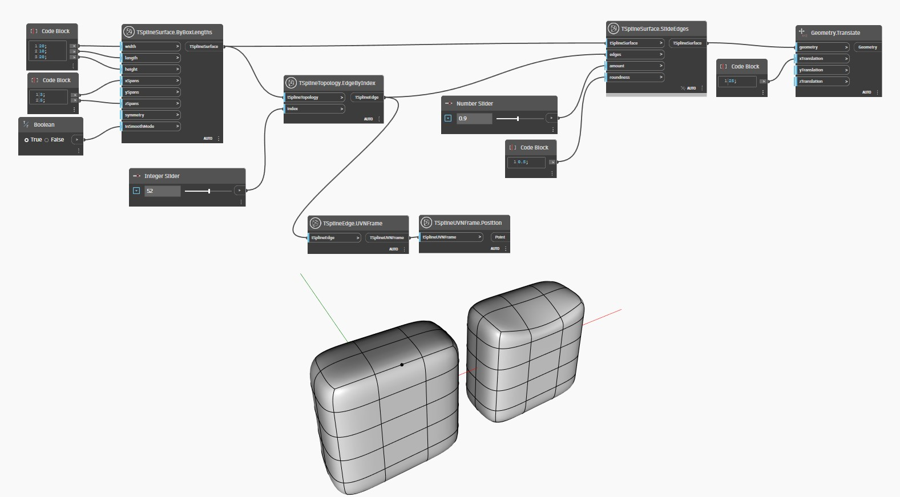

## Подробности
В приведенном ниже примере создается простая Т-сплайновая поверхность рамки, одно из ребер которой выбирается с помощью узла `TSplineTopology.EdgeByIndex`. Положение выбранной вершины визуализируется с помощью узлов `TSplineEdge.UVNFrame` и `TSplineUVNFrame.Position`. Выбранное ребро передается в качестве входного значения для узла `TSplineSurface.SlideEdges` вместе с поверхностью, к которой оно относится. Входной параметр `amount` определяет расстояние сдвига ребра в направлении соседних ребер в процентах. Входной параметр `roundness` управляет плоскостностью или округлостью скоса. Эффект округлости лучше понятен в режиме рамки. Результат операции сдвига затем смещается в сторону для предварительного просмотра.

___
## Файл примера

