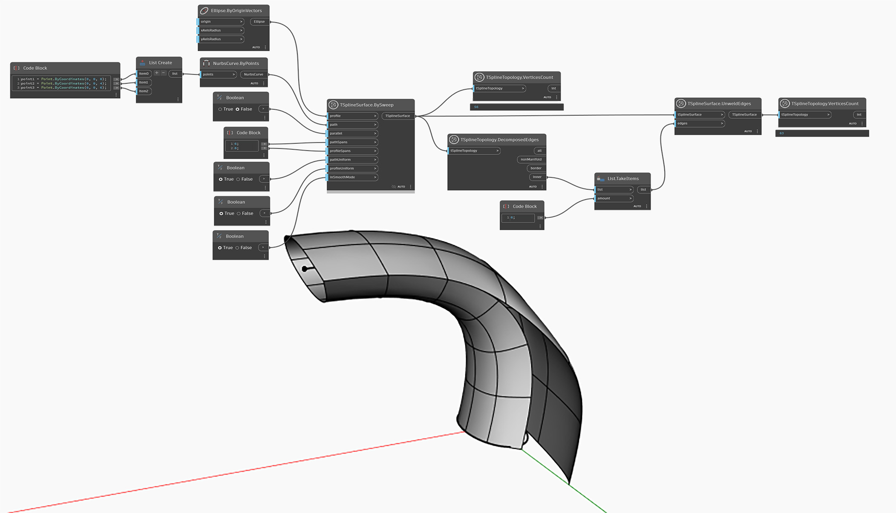

## In-Depth

В приведенном ниже примере выполняется операция разъединения для ряда ребер Т-сплайновой поверхности. В результате вершины выбранных ребер разделяются. В отличие от операции удаления сгиба, которая создает резкий переход вокруг ребра с сохранением соединения, операция разъединения создает разрыв. Для проверки сравните количество вершин до и после выполнения операции. Все последующие операции над разъединенными ребрами или вершинами также продемонстрируют, что поверхность отсоединена вдоль разъединенного ребра.

