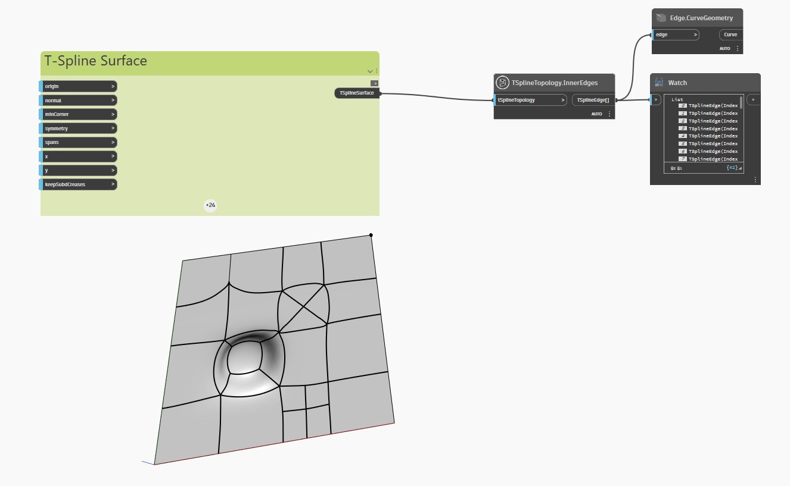

## Подробности
В приведенном ниже примере плоская Т-сплайновая поверхность с выдавленными, разделенными и вытянутыми вершинами и гранями проверяется с помощью узла `TSplineTopology.InnerEdges`.

Узел `Edge.CurveGeometry` используется для выделения внутренних ребер поверхности.

___
## Файл примера

