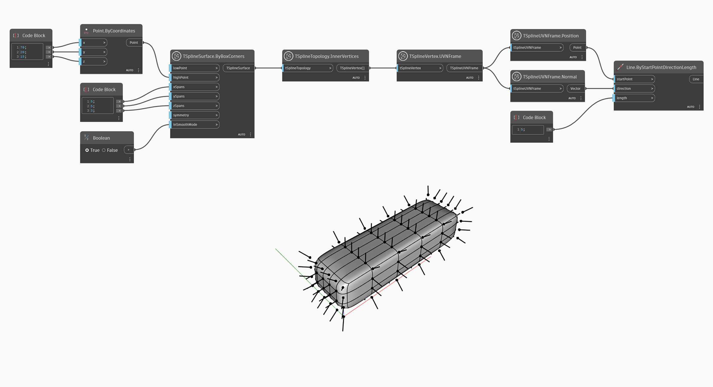

## In-Depth
Узел `TSplineUVNFrame.Normal` возвращает нормаль вектора кадра UVN.
В приведенном ниже примере этот узел используется вместе с узлом `TSplineUVNFrame.Position` для визуализации нормалей вершин Т-сплайновой поверхности.

## Файл примера

