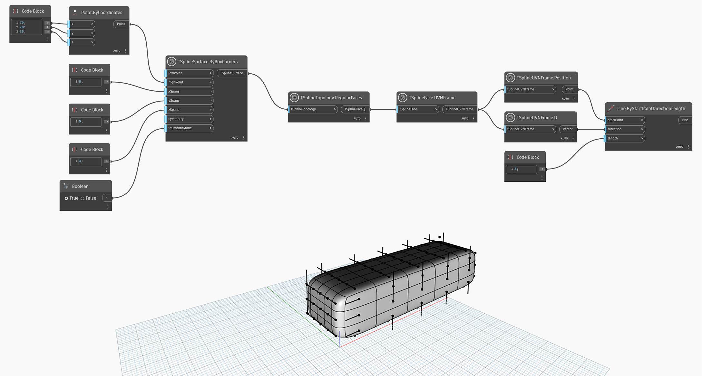

## In-Depth
Узел `TSplineUVNFrame.U` возвращает вектор U кадра UVN. В приведенном ниже примере отрезки используются для визуализации направления вектора U на кадрах UVN каждой грани Т-сплайновой рамки-примитива.

## Файл примера

