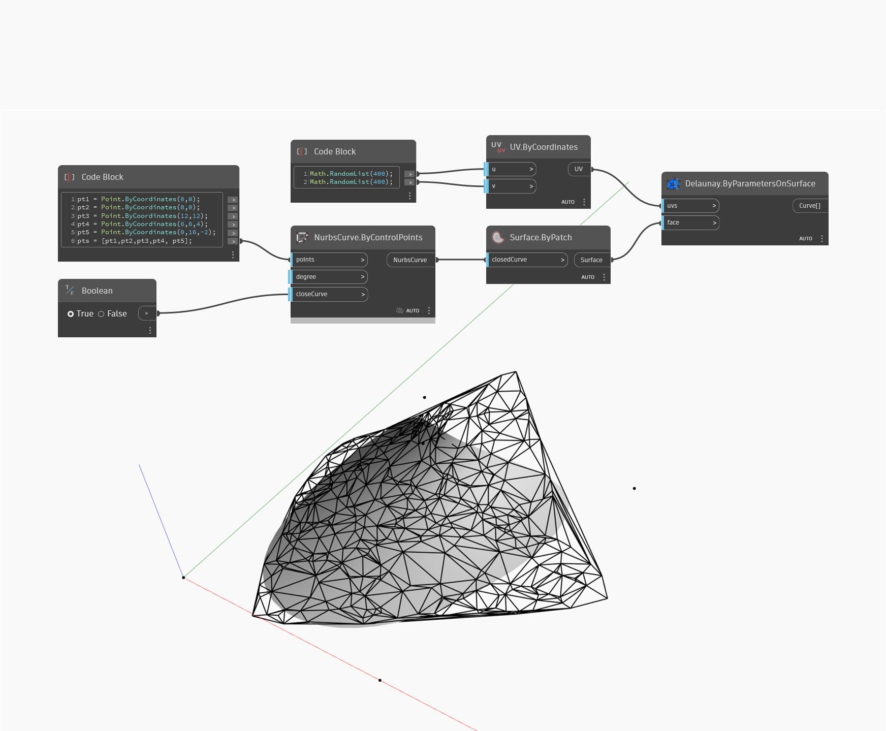

## Подробности
`UV.ByCoordinates` возвращает UV из двух списков чисел двойной точности. U и V — это горизонтальные и вертикальные координаты соответственно, определяющие способ применения 2D-текстур к 3D-поверхности.

В примере ниже UV возвращается из 400 случайных значений для создания триангуляции Делоне объекта NurbsSurface.

___
## Файл примера

