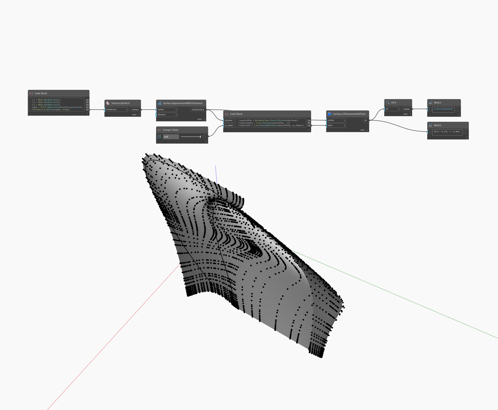

## Подробности
V возвращает значение V координаты UV. В примере ниже возвращается значение V расположения точки на NURBS-поверхности. Параметр UV возвращается из узла Surface.UVParamterAtPoint.
___
## Файл примера

