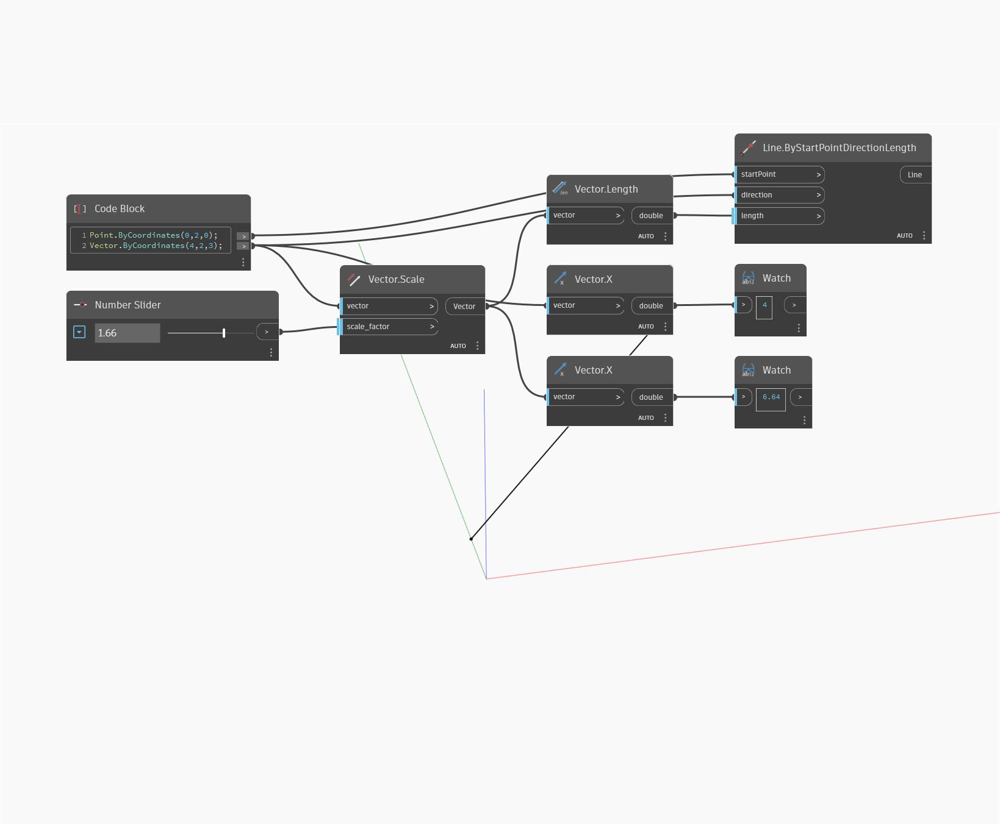

## Подробности
Length возвращает длину границы панели витража в виде числа двойной точности. Этот узел можно использовать даже в том случае, если панель витража не является прямоугольной.
___
## Файл примера

