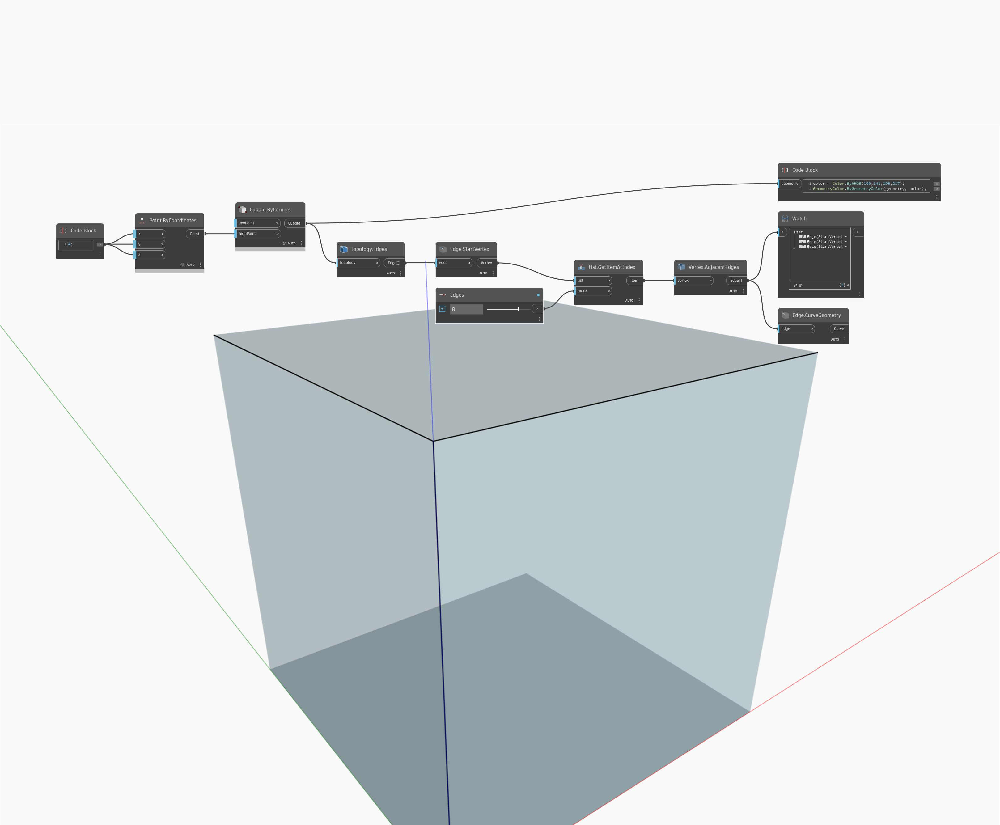

## Подробности
AdjacentEdges возвращает ребра, выходящие из вершины. В примере ниже ребра, выходящие из вершины куба, представлены в виде линий. Перемещая регулятор ребер, можно получать различные наборы смежных ребер.
___
## Файл примера

