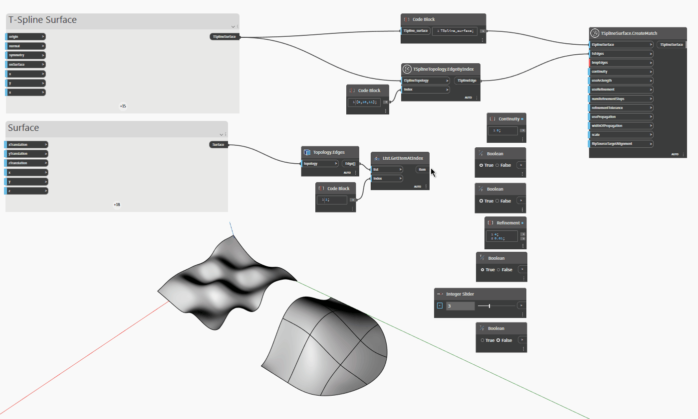

## Подробности

В приведенном ниже примере Т-сплайновая поверхность сопоставляется с ребром поверхности с граничным представлением с помощью узла `TSplineSurface.CreateMatch(tSplineSurface,tsEdges,brepEdges)`. Минимальный ввод, необходимый для узла, — базовая поверхность `tSplineSurface`, набор ребер поверхности, задаваемый входным параметром `tsEdges`, и ребро или список ребер, задаваемый параметром `brepEdges`. Параметры сопоставления определяются следующими входными параметрами:
— `continuity`: позволяет задать тип непрерывности для сопоставления. Для входного параметра необходимо указать значение 0, 1 или 2, соответствующее позиционной непрерывности G0, непрерывности по касательной G1 или по кривизне G2.
— `useArcLength`: управляет параметрами типа выравнивания. Если задано значение True, используется тип выравнивания «Длина дуги». Это выравнивание минимально сокращает физическое расстояние между каждой точкой Т-сплайновой поверхности и соответствующей точкой на кривой. Если задано значение False, используется тип выравнивания «Параметрическое»: каждая точка на T-сплайновой поверхности сопоставляется с точкой на сравнимом параметрическом расстоянии вдоль целевой кривой сопоставления.
— `useRefinement`: если задано значение True, добавляет на поверхность управляющие точки для сопоставления с целью в пределах заданного допуска уточнения (параметр `refinementTolerance`).
- `numRefinementSteps` is the maximum number of times that the base T-Spline surface is subdivided
while attempting to reach `refinementTolerance`. Both `numRefinementSteps` and `refinementTolerance` will be ignored if the `useRefinement` is set to False.
- `usePropagation` controls how much of the surface is affected by the match. When set to False, the surface is minimally affected. When set to True, the surface is affected within the provided `widthOfPropagation` distance.
- `scale` is the Tangency Scale which affects results for G1 and G2 continuity.
- `flipSourceTargetAlignment` reverses the alignment direction.

## Файл примера

