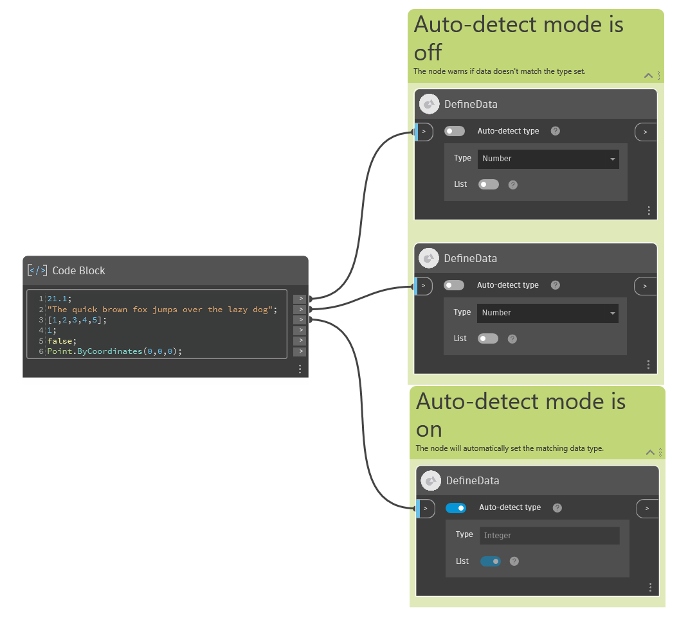

## Подробности

Узел Define Data проверяет тип входных данных. Его можно использовать для проверки того, имеют ли локальные данные требуемый тип. Кроме того, он предназначен для использования в качестве узла ввода или вывода, объявляющего типе данных, который ожидается или предоставляется графиком. Этот узел поддерживает ряд часто используемых типов данных Dynamo, таких как String, Point или Boolean. Полный список поддерживаемых типов данных представлен в раскрывающемся меню узла. Узел поддерживает данные в виде отдельного значения или неструктурированного списка. Вложенные списки, словари и репликация не поддерживаются.

### Поведение

Узел проверяет данные, поступающие из порта ввода, на основе настроек раскрывающегося меню типа и переключателя «Список» (см. подробные сведения ниже). Если проверка прошла успешно, вывод узла совпадает с вводом. Если проверка не пройдена, узел переходит в состояние предупреждения с пустым выводом.
У узла есть один ввод:

-   Ввод **>**: подключение к вышестоящему узлу для проверки типа его данных.
    Кроме того, узел предлагает три пользовательских элемента управления:
-   Переключатель **Автоопределение типа**: когда он включен, узел анализирует входящие данные; если тип этих данных поддерживается, узел задает значения элементов управления «Тип» и «Список» на основе типа входящих данных. Меню раскрывающегося списка «Тип» и переключатель «Список» отключаются и будут автоматически обновляться на основе узла ввода.

    Если переключатель «Автоопределение типа» отключен, можно указать тип данных с помощью меню «Тип» и переключателя «Список». Если входящие данные не совпадают с указанным значением, узел переходит в состояние предупреждения с пустым выводом.
-   Раскрывающееся меню **Тип**: в нем задается ожидаемый тип данных. Если этот элемент управления включен (переключатель **Автоопределение типа** отключен), укажите тип данных для проверки. Если этот элемент управления отключен (переключатель **Автоопределение типа** включен), тип данных устанавливается автоматически на основе входящих данных. Данные являются допустимыми, если их тип точно соответствует отображаемому типу или он является дочерним для отображаемого типа (например, если в раскрывающемся списке «Тип» выбрано значение «Кривая», допустимыми являются объекты типа «Прямоугольник», «Линия» и т. д.).
-   Переключатель **Список**: если он включен, узел ожидает, что входящие данные будут представлять собой единый неструктурированный список, содержащий элементы допустимого типа (см. выше). Если он отключен, узел ожидает один элемент допустимого типа данных.

### Использовать в качестве узла ввода

Если этот параметр задан как ввод (указан в контекстом меню узла как «Является вводом»), узел может при необходимости использовать вышестоящие узлы, чтобы задать значения по умолчанию для входных данных. При запуске графика будет кэшировано значение узла Define Data для использования при внешнем запуске графика, например с узлом Engine.

## Файл примера

В примере ниже первая группа узлов DefineData имеет отключенный переключатель **Автоопределение типа**. Узел правильно проверяет введенное число при отклонении ввода строки. Вторая группа содержит узел с включенным переключателем **Автоопределение типа**. Узел автоматически настраивает раскрывающийся список «Тип» и переключатель «Список» в соответствии с вводом (в данном случае список целых чисел).

