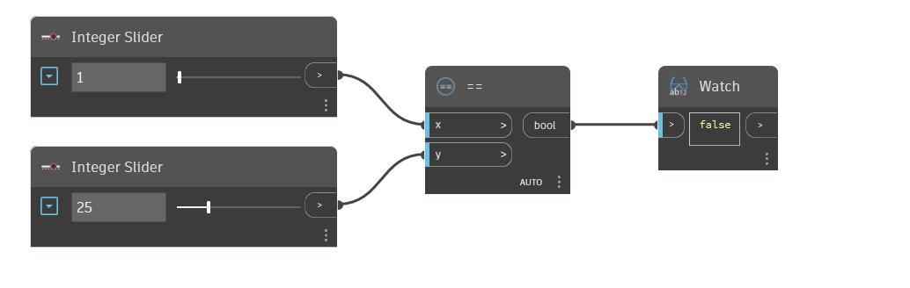

## Подробности
== — это оператор равенства. Если вводимое значение x равно вводимому значению y, то возвращается значение True. Если два значения не равны, этот оператор возвращает значение False. В примере ниже входные значения для оператора == задаются с помощью двух регуляторов чисел.
___
## Файл примера

