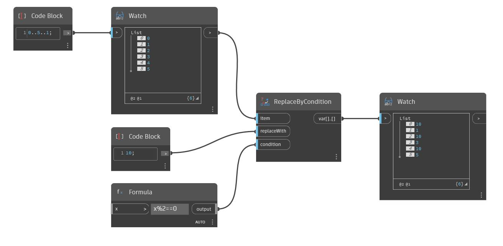

## Подробности
ReplaceByCondition принимает заданный список и оценивает каждый элемент на соответствие заданному условию. При выполнении условия соответствующий элемент заменяется в списке вывода элементом, указанным во вводимом значении replaceWith. В примере ниже используется узел Formula и вводится формула x%2==0, которая ищет остаток от деления заданного элемента на 2, а затем проверяет, равен ли этот остаток нулю. Эта формула возвращает значение True для четных целых чисел. Обратите внимание, что входное значение x оставлено пустым. Использование этой формулы в качестве условия в узле ReplaceByCondition приводит к созданию списка вывода, в котором каждое четное число заменяется указанным элементом (в данном случае целым числом 10).
___
## Файл примера

