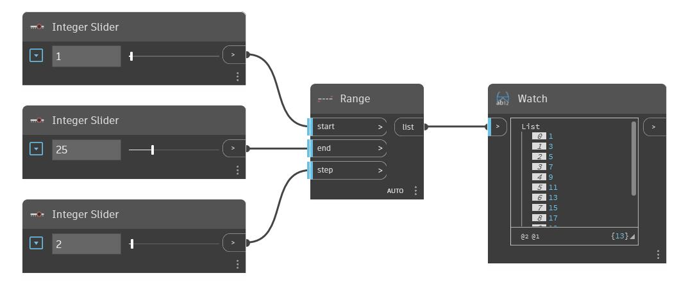

## Подробности
Range позволяет создать список чисел между заданными входными значениями Start и End. Числа увеличиваются, начиная с входного значения Start, в соответствии с шагом. В примере ниже диапазон начинается с 1 и заканчивается на 25. При использовании шага, равного 2, результат представляет собой нечетные числа в диапазоне от 1 до 25.
___
## Файл примера

