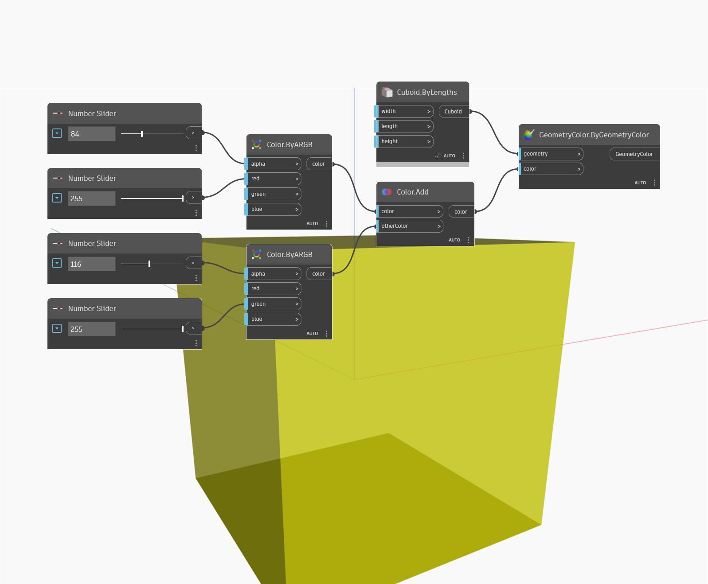

## Подробности
Add возвращает вектор, являющийся суммой двух других векторов. В примере ниже сумма векторов осей Z и X МСК образует вектор с координатами (1,0,1). Новый вектор представлен в виде линии.
___
## Файл примера

