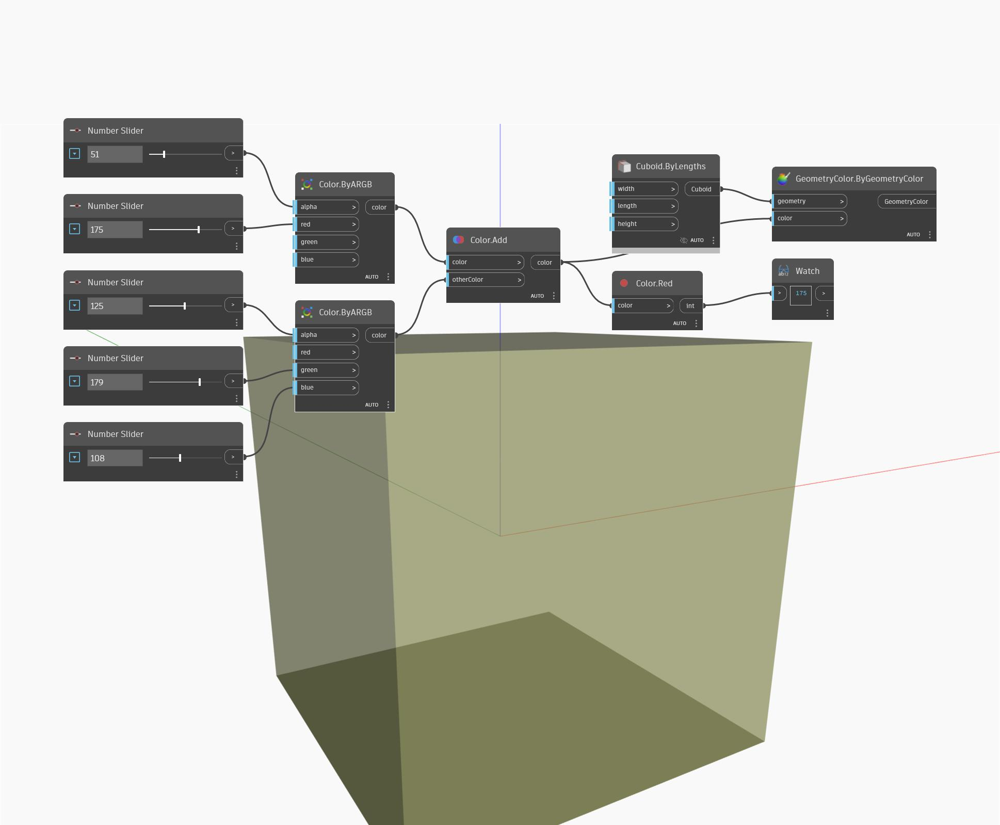

## Подробности
Red возвращает значение красного цвета для входного цвета в диапазоне от 0 до 255. В примере ниже с помощью узлов ByARGB создаются два цвета, которые затем объединяются. Значение красного цвета для результирующего цвета можно найти с помощью узла Red.
___
## Файл примера

