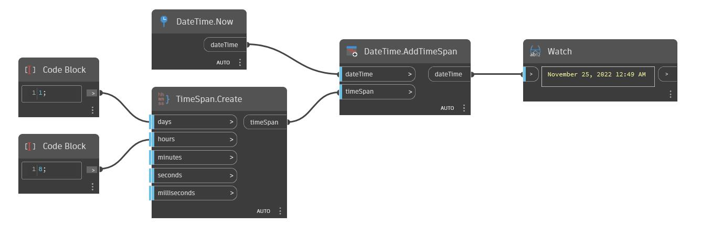

## Подробности
AddTimeSpan возвращает новое значение dateTime, к которому прибавлено значение timeSpan. В примере ниже к значению dateTime на текущий момент времени прибавляется один день и восемь часов, в результате чего возвращается дата, отстоящая на один день и восемь часов вперед.
___
## Файл примера

