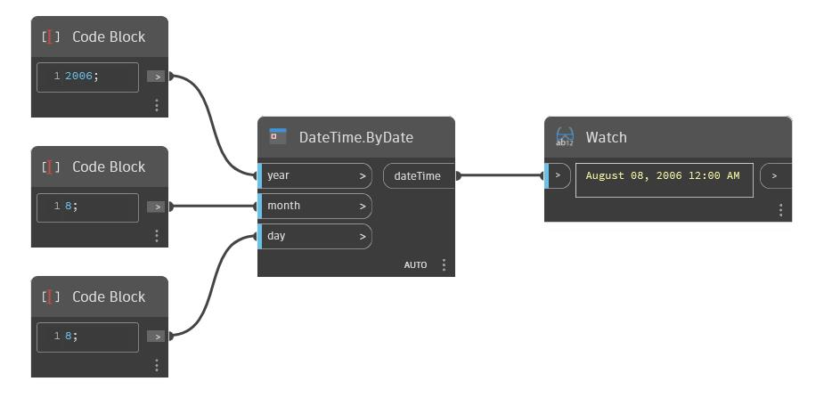

## Подробности
ByDate возвращает значение dateTime на основе входных значений года, месяца и дня. В примере ниже на основе соответствующих входных значений создается новое значение dateTime, равное August 08, 2006.
___
## Файл примера

