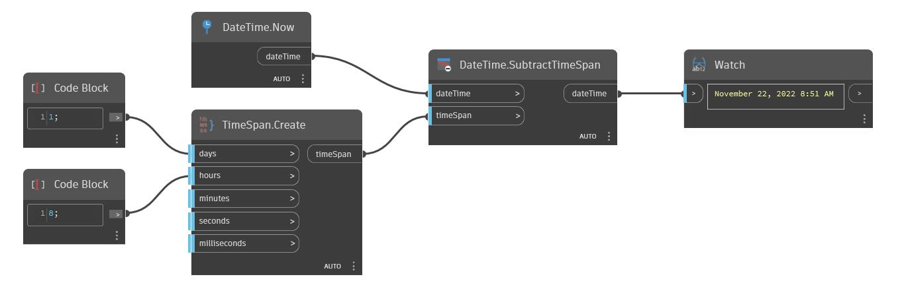

## Подробности
SubtractTimeSpan возвращает новое значение dateTime, полученное путем вычитания значения timeSpan из значения dateTime. В примере ниже значение timeSpan, равное одному дню и восьми часам, вычитается из значения dateTime в узле Now, в результате чего возвращается значение dateTime, равное November 13, 2016 4:40AM.
___
## Файл примера

