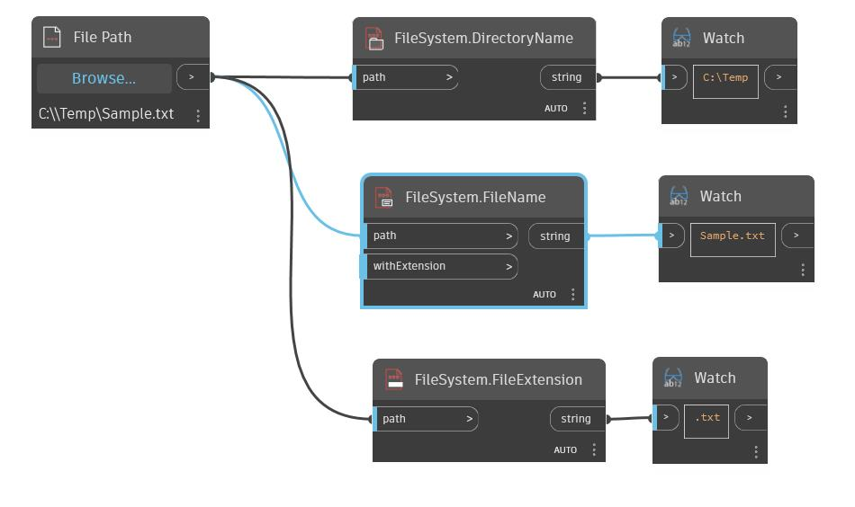

## Подробности
FileName возвращает имя файла из входного пути к файлу. Входное логическое значение позволяет возвращать имя файла с расширением или без расширения. Этот узел наряду с узлами DirectoryName и Extension позволяет разбить путь к файлу на отдельные компоненты.
___
## Файл примера

