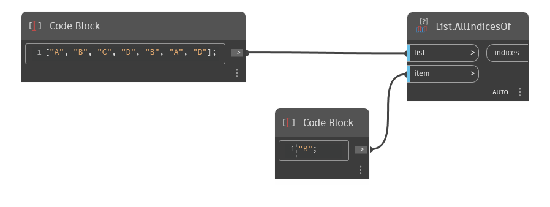

## Подробности
`List.AllIndicesOf` выполняет поиск заданного элемента в заданном списке и возвращает список индексов, в которых он найден. Если элемент не найден, `List.AllIndicesOf` возвращает пустой список.

В примере ниже сначала создается список строк, каждая из которых представляет собой букву от A до D. Затем с помощью `List.AllIndicesOf` выполняется поиск строки B в этом списке, которая находится в элементах с индексами 1 и 4.
___
## Файл примера

