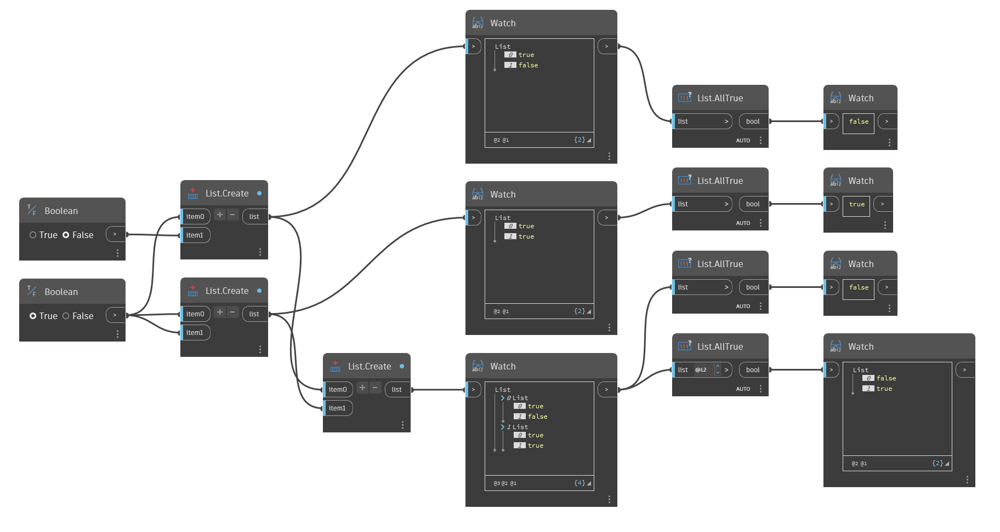

## Подробности
`List.AllTrue` возвращает значение False, если какой-либо элемент в заданном списке имеет значение False или не является логическим значением. `List.AllTrue` возвращает значение True, только если каждый элемент в списке является логическим значением True.

В примере ниже с помощью метода `List.AllTrue` обрабатываются списки логических значений. Первый список содержит значение False, поэтому возвращается значение False. Второй список содержит только значения True, поэтому возвращается значение True. Третий список имеет вложенный список, содержащий значение False, поэтому возвращается значение False. Конечный узел оценивает два вложенных списка и возвращает значение False для первого из них, так как в нем есть значение False, и значение True для второго, поскольку в нем есть только значения True.
___
## Файл примера

