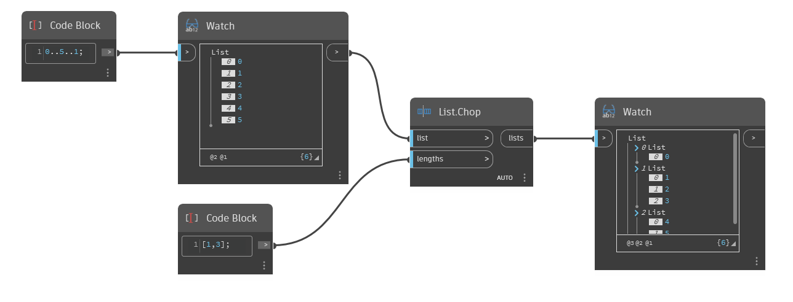

## Подробности
`List.Chop` разбивает данный список на более мелкие списки, длина которых определяется по списку входных целых значений. Количество элементов в первом вложенном списке равно первому числу во входном параметре `lengths`. Количество элементов во втором вложенном списке равно второму числу во входном параметре Lengths и т. д. `List.Chop` будет использовать последнее число из входного параметра `lengths`, пока исходный список не будет разбит до конца.

В примере ниже с помощью блока кода создается диапазон чисел от 0 до 5 с шагом 1. В этом списке содержится 6 элементов. Второй блок кода создает список длин, которые будут использоваться для разделения первого списка. Первое число в этом списке равно 1, поэтому `List.Chop` создает вложенный список с 1 элементом. Второе число равно 3, поэтому создается вложенный список с 3 элементами. Поскольку другие значения длины отсутствуют, `List.Chop` включает все оставшиеся элементы в третий и последний вложенный список.
___
## Файл примера

