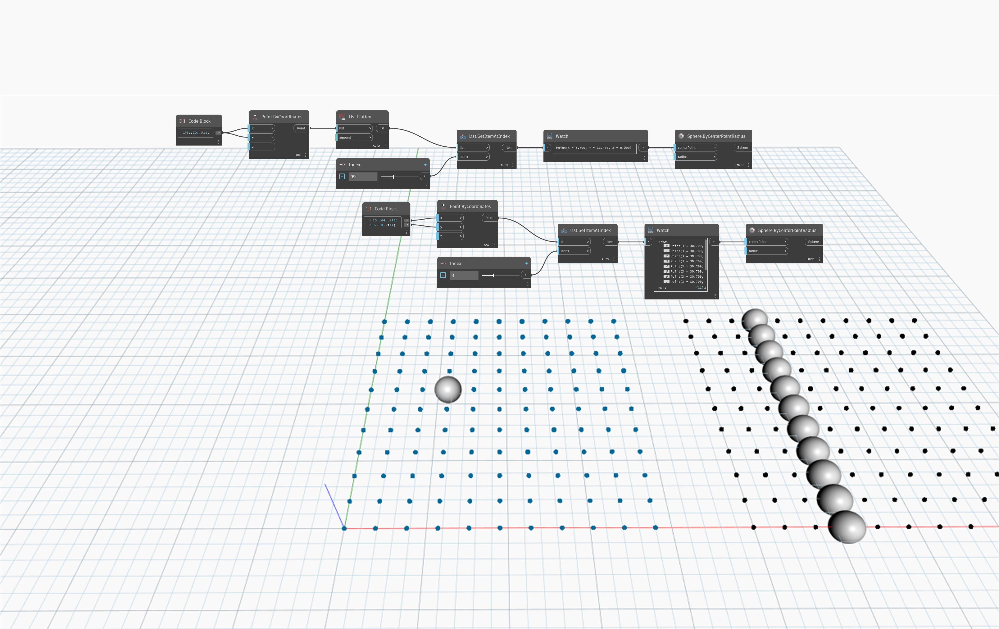

## Подробности
`List.Flatten` возвращает одномерный список (список с одним уровнем), полученный из многомерного списка (списка, в котором есть по крайней мере один вложенный список).

В примере ниже два списка сетки точек сравниваются путем создания сферы в заданном индексе каждой сетки. Для выровненного списка точек возвращается 1 точка в месте расположения индекса. Для невыровненного списка возвращаются 10 точек в месте расположения индекса, так как каждый индекс содержит ряд точек.
___
## Файл примера

