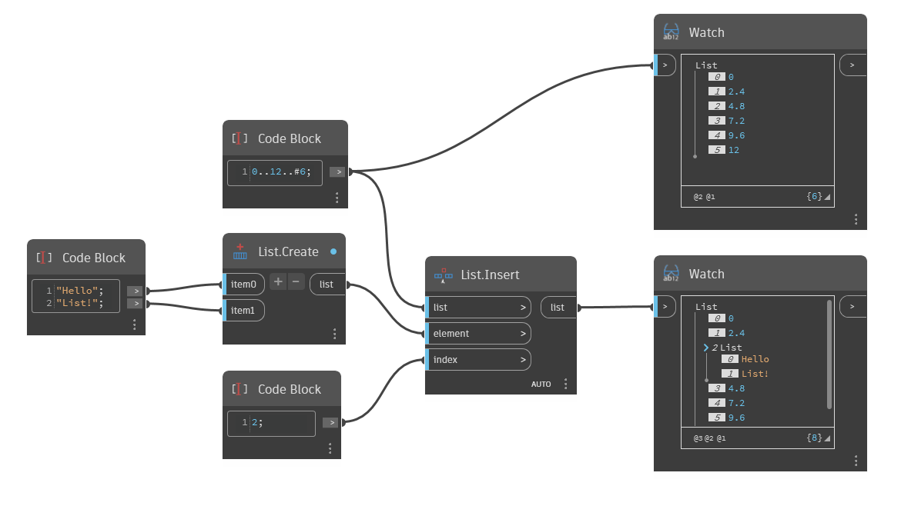

## Подробности
`List.Insert` размещает несколько элементов в списке по заданному индексу.

В приведенном ниже примере список, содержащий две строки, Hello и List!, вставляется по индексу 2 в качестве вложенного списка, создавая новый список, который на один индекс длиннее исходного списка.

___
## Файл примера

