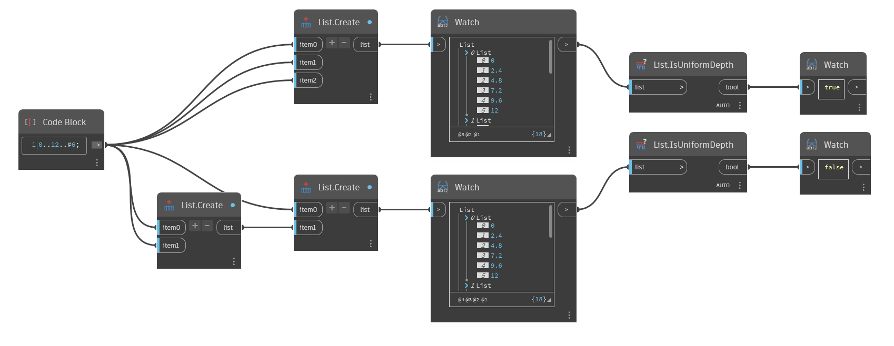

## Подробности
`List.IsUniformDepth` возвращает логическое значение, которое указывает, является ли глубина списка согласованной, то есть находится ли в каждом списке одинаковое количество вложенных списков.

В примере ниже сравниваются два списка, один с равномерной и один с неравномерной глубиной. Список с равномерной глубиной содержит три списка без вложенных списков. Список с неравномерной глубиной содержит два списка. В первом из них нет вложенных списков, а во втором — два вложенных списка. Списки в [0] и [1] имеют разную глубину, поэтому `List.IsUniformDepth` возвращает значение False.
___
## Файл примера

