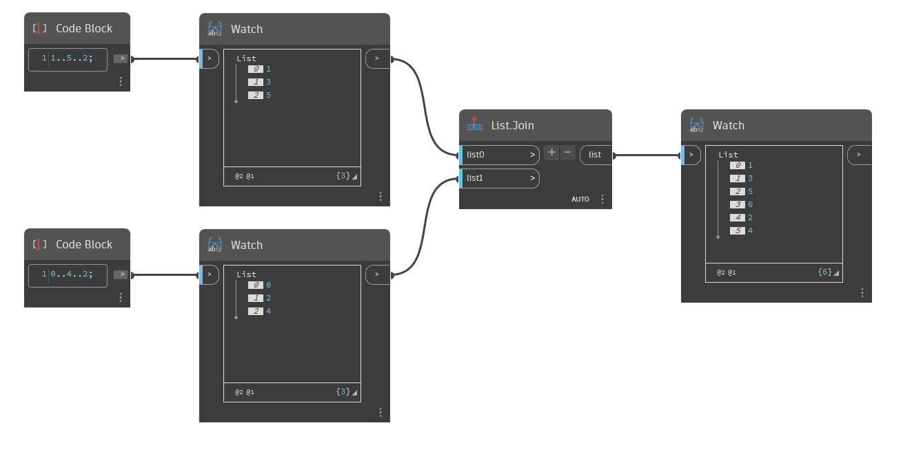

## Подробности
`List.Join` объединяет списки, переданные в аргументах, в один список. Количество входных списков можно настроить с помощью кнопок «+» и «-» в узле Join.

В примере ниже сначала с помощью двух блоков кода создается два диапазона чисел. В первом содержатся нечетные числа [1,3,5], а во втором — четные [0,2,4]. С помощью узла `List.Join` эти два списка можно объединить в один [1,3,5,0,2,4].

___
## Файл примера

