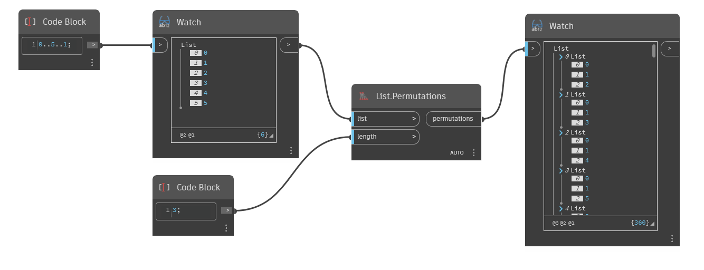

## Подробности
`List.Permutations` создает вложенный список, состоящий из всех перестановок заданной длины из заданного входного списка.

В примере ниже с помощью блока кода создается диапазон чисел от 0 до 5 с шагом 1. Затем с помощью узла `List.Permutations` с входным значением Length, равным 3, создаются все перестановки из 3 элементов диапазона [0,1,2,3,4,5].
___
## Файл примера

