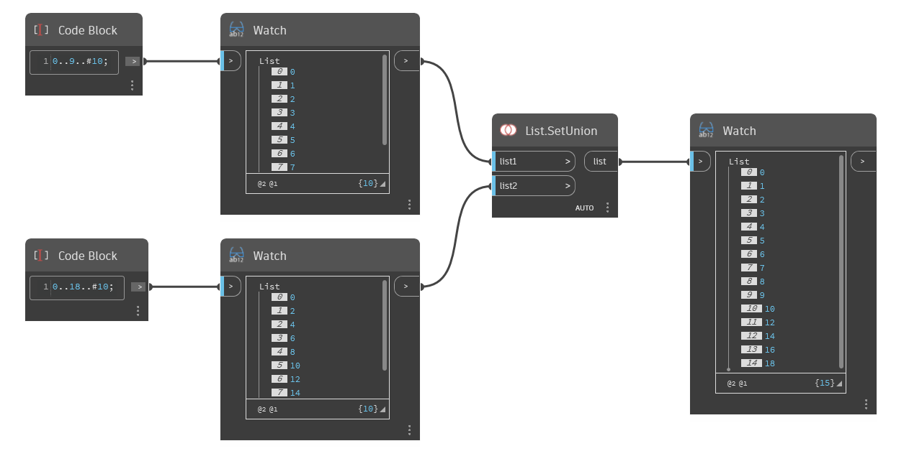

## Подробности
`List.SetUnion` возвращает новый список, объединяя объекты из двух входных списков и исключая повторяющиеся значения.

В примере ниже список чисел от 0 до 9 с шагом 1 объединяется со списком чисел от 0 до 18 с шагом 2. Получившийся список содержит все элементы из списка List1 и List2 без дубликатов (0, 2, 4 и т. д.).
___
## Файл примера

