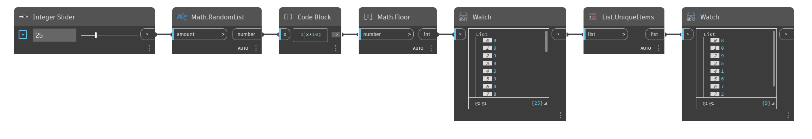

## Подробности
`List.UniqueItems` удаляет все повторяющиеся элементы из входного списка путем создания нового списка, в который входят только уникальные элементы из исходного списка.

В примере ниже с помощью `Math.RandomList` создается список случайных чисел от 0 до 1. Затем они умножаются на 10. Далее с помощью `Math.Floor` возвращается список случайных целых чисел от 0 до 9, причем многие из них повторяются по несколько раз. С помощью `List.UniqueItems` создается список, в котором каждое целое число встречается только один раз. Порядок элементов в выходном списке определяется значением, которое было найдено первым.
___
## Файл примера

