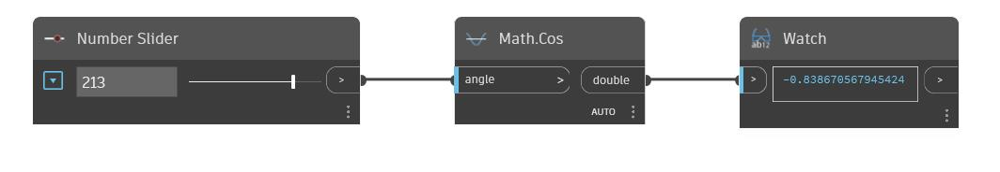

## Подробности
Cos возвращает косинус входного угла в градусах. В примере ниже входной угол для узла Cos задается с помощью числового регулятора с диапазоном значений от -360 до 360.
___
## Файл примера

