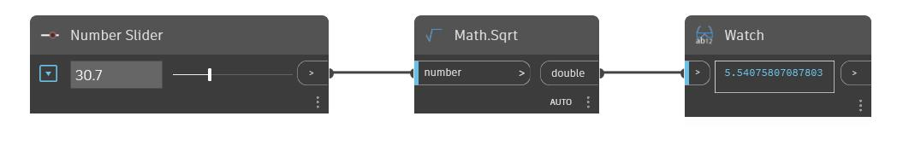

## Подробности
Sqrt возвращает квадратный корень из входного числа. Sqrt принимает только положительные числа. В примере ниже входное значение для узла Sqrt задается с помощью численного регулятора.
___
## Файл примера

