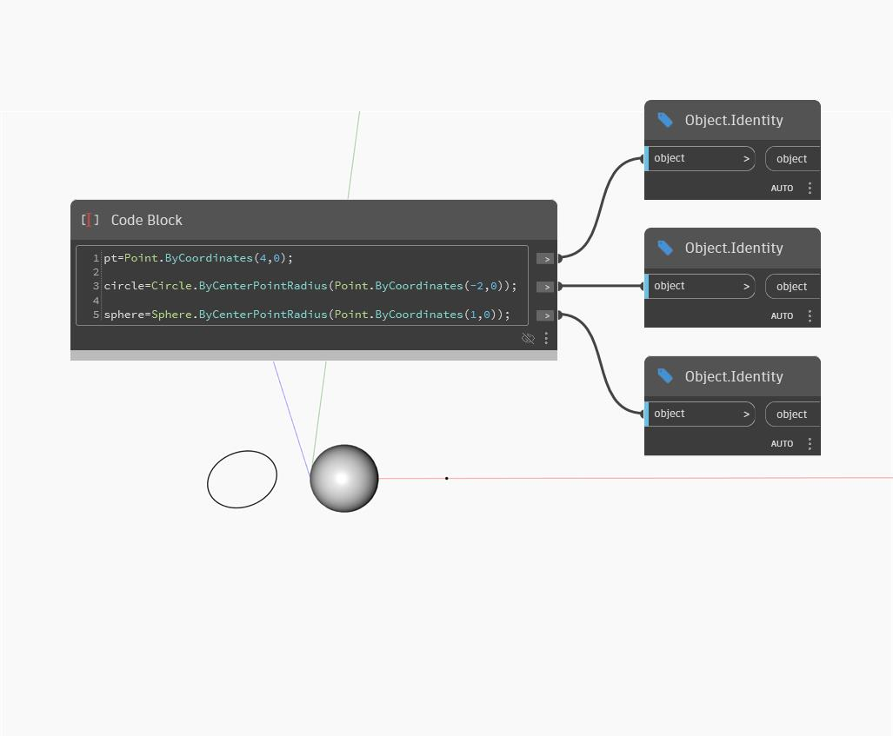

## Подробности
Узел Identity возвращает переданный ему объект. В примере ниже узел Identity используется для предварительного просмотра каждого элемента геометрии, созданного внутри Code Block.
___
## Файл примера

