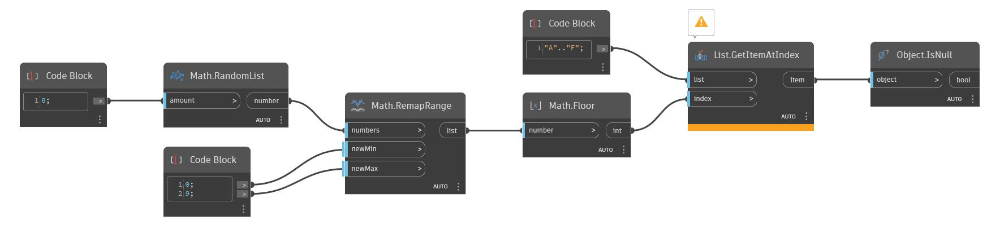

## Подробности
IsNull возвращает логическое значение, показывающее, является ли объект нулевым. В примере ниже строится сетка окружностей с различными радиусами на основе уровня красного в растровом изображении. Если красного значения нет, окружность не строится, а в списке окружностей возвращается нулевое значение. При передаче этого списка узлу IsNull возвращается список логических значений, в котором значение True представляет каждое расположение с нулевым значением. Этот список логических значений можно использовать с узлом List.FilterByBoolMask для возврата списка без нулевых значений.
___
## Файл примера

