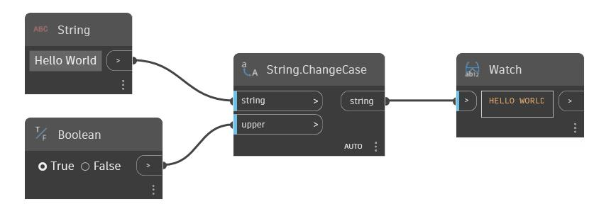

## Подробности
ChangeCase принимает в качестве входных элементов строку и логическое значение. Если входное логическое значение равно True, регистр входной строки меняется на верхний. Если входное логическое значение равно False, регистр входной строки меняется на нижний. В примере ниже в качестве входной строки используется строка Hello World, а логический переключатель указывает, следует ли изменять регистр всей строки на верхний или нижний.
___
## Файл примера

