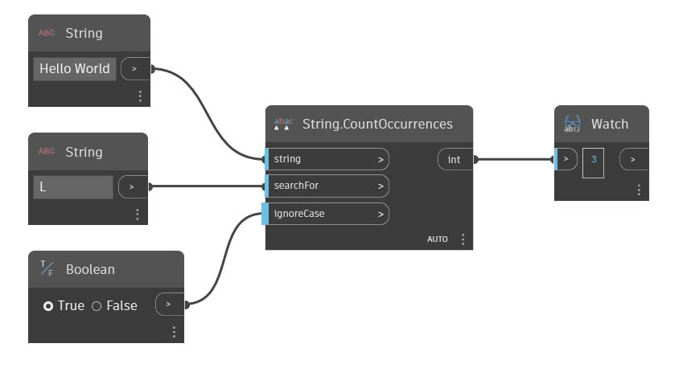

## Подробности
CountOccurrences позволяет найти в заданной строке вторую входную строку и возвращает количество вхождений второй строки в первой. По умолчанию этот узел чувствителен к регистру. Для входного параметра ignoreCase можно использовать логическое значение, чтобы узел игнорировал регистр строк. В примере ниже выполняется поиск строки «L» в строке Hello World. Так как параметру ignoreCase присвоено значение True, узел CountOccurrences трижды находит заданную строку в строке Hello World.
___
## Файл примера

