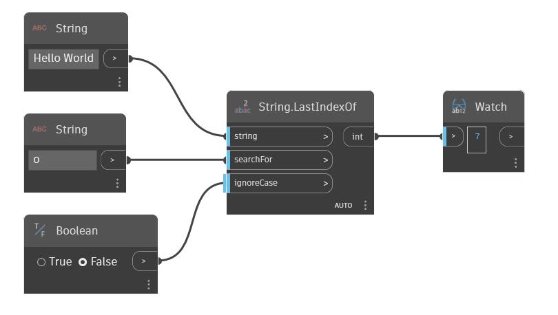

## Подробности
LastIndexOf позволяет найти в заданной строке вторую входную строку. При обнаружении второй строки этот узел возвращает индекс последнего вхождения. По умолчанию этот узел чувствителен к регистру. Для входного параметра ignoreCase можно использовать логическое значение, чтобы узел игнорировал регистр строк. В примере ниже выполняется поиск строки «o» в строке Hello World. Эта строка встречается в строке дважды, и возвращается индекс ее последнего вхождения.
___
## Файл примера

