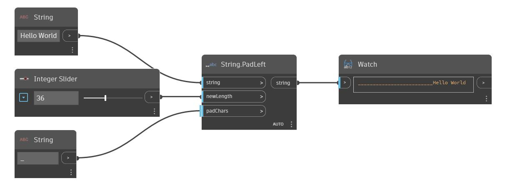

## Подробности
PadLeft позволяет увеличить ширину входной строки в соответствии с входным значением newWidth путем добавления входного значения padChars в левую часть исходной строки. Если исходная строка длиннее входного значения newWidth, этот узел возвращает исходную строку без изменений. В примере ниже в качестве входной строки используется строка Hello World. В качестве заполняющего символа используется строка с символом подчеркивания, а новая ширина строки задается с помощью целочисленного регулятора.
___
## Файл примера

