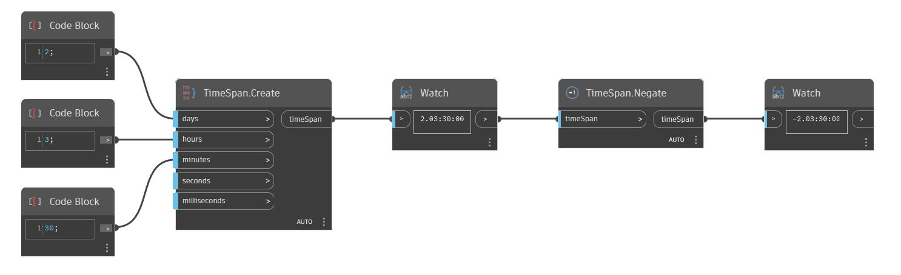

## Подробности
Negate возвращает отрицательное значение TimeSpan. В примере ниже значение TimeSpan, равное 2 дням, 3 часам и 30 минутам, преобразуется в отрицательное (-2.03:30:00).
___
## Файл примера

