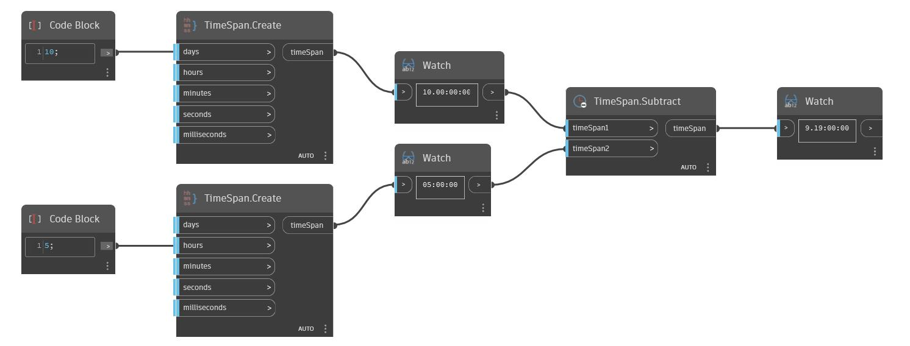

## In Depth
Subtract will return a Vector that is the difference of two other Vectors. In the example below, the difference of the a Vector with coordinates (1,0,1) and WCS Z axis results in a Vector with coordinates of (1,0,0). Adjusting the Vector Direction slider will change the vector's coordinate values and return a different subtracted vector. The Vectors are represented as Lines.
___
## Example File

