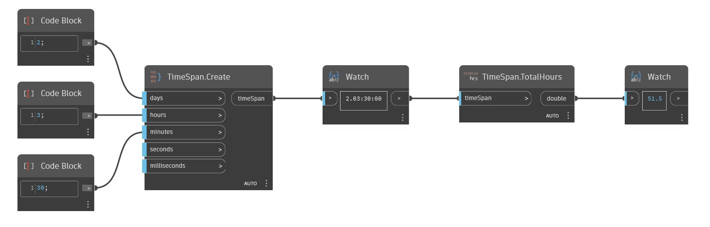

## Подробности
TotalHours возвращает количество часов в значении TimeSpan в виде числа двойной точности. В примере ниже общее количество часов, возвращенное на основе значения TimeSpan, равного 2.03:00:00, равно 51,5.
___
## Файл примера

