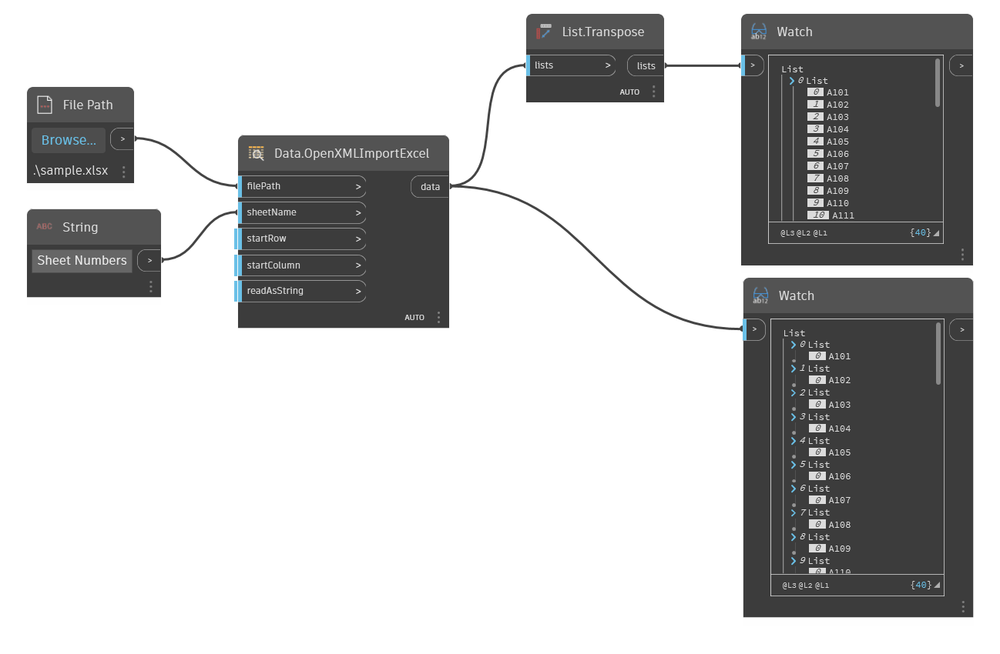

## Подробности
Data.OpenXMLImportExcel считывает данные из файла Microsoft Excel с использованием стандарта OpenXML. Эта версия узлов Excel не требует наличия приложения Excel на компьютере.
___
## Файл примера

