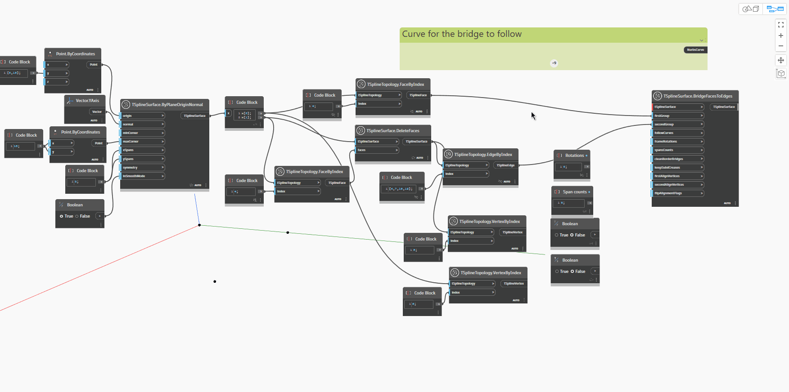

<!--- Autodesk.DesignScript.Geometry.TSpline.TSplineSurface.BridgeFacesToEdges --->
<!--- DVNDD4ZUEDM4QCH35SLRIEZJLS266CIRRB7MZMMNDBI5W6UPBSQA --->
## Подробности
Узел `TSplineSurface.BridgeToFacesToEdges` соединяет набор ребер с набором граней, относящихся либо к одной и той же поверхности, либо к двум разным поверхностям. Количество ребер, образующих грани, должно быть одинаковым или кратным количеству ребер с другой стороны перемычки. Узел требует задания входных параметров, перечисленных ниже. Первых трех входных параметров достаточно для создания перемычки; остальные входные параметры являются необязательными. Итоговая поверхность представляет собой дочерний объект поверхности, к которой относится первая группа ребер.

— `TSplineSurface`: поверхность для добавления перемычки.
— `firstGroup`: грани из выбранной поверхности TSplineSurface.
— `secondGroup`: ребра либо с выбранной Т-сплайновой поверхности, либо с другой поверхности. Количество ребер должно быть равно количеству ребер с другой стороны перемычки или кратным ему.
— `followCurves`: (необязательно) кривая, по которой должна проходить перемычка. Если этот входной параметр не задан, перемычка проходит по прямой.
— `frameRotations`: (необязательно) число поворотов выдавленной перемычки, соединяющей выбранные ребра.
— `spansCounts`: (необязательно) количество пролетов/сегментов выдавленной перемычки, соединяющей выбранные ребра. Если количество пролетов слишком мало, некоторые параметры могут быть недоступны до тех пор, пока оно не будет увеличено.
— `cleanBorderBridges`: (необязательно) удаляет перемычки между перемычками границ для предотвращения сгибов.
— `keepSubdCreases`: (необязательно) сохраняет сгибы SubD входной топологии, что приводит к сгибанию начала и конца перемычки.
— `firstAlignVertices` (необязательно) и `secondAlignVertices`: принудительное выравнивание между двумя наборами вершин вместо автоматического соединения пар ближайших вершин.
— `flipAlignFlags`: (необязательно) изменение направления вершин, которые требуется выровнять, на противоположное.

В приведенном ниже примере создаются две Т-сплайновые плоскости; узлы `TSplineTopology.VertexByIndex` и `TSplineTopology.FaceByIndex` извлекают наборы ребер и граней. Для создания перемычки грани и ребра вместе с одной из поверхностей используются в качестве входных данных для узла `TSplineSurface.BrideFacesToEdges`. К созданной перемычке добавляются пролеты путем изменения входного параметра `spansCounts`. Если в качестве значения входного параметра `followCurves` используется кривая, перемычка проходит в направлении, заданном этой кривой. Входные параметры `keepSubdCreases`, `frameRotations`, `firstAlignVertices` и `secondAlignVertices` демонстрируют возможности настройки формы перемычки.

## Файл примера

