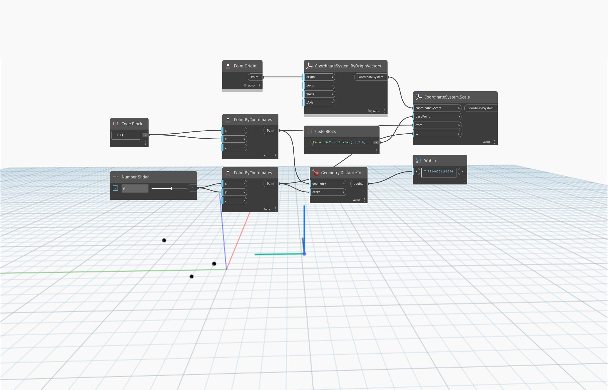

<!--- Autodesk.DesignScript.Geometry.CoordinateSystem.Scale(coordinateSystem, basePoint, from, to) --->
<!--- DXEUCQG4Y4M6N76367ZJYZYJJOLPKVDC5UFPTIBMDW6CC5ORFAXQ --->
## Подробности
`CoordinateSystem.Scale (coordinateSystem, basePoint, from, to)` возвращает масштабированный объект CoordinateSystem на основе базовой, начальной и конечной точек масштабирования. Входное значение `basePoint` определяет начало масштабирования (насколько перемещается объект CoordinateSystem). Расстояние между точками `from` и `to` определяет величину масштабирования.

В приведенном ниже примере входное значение `basePoint` (-1, 2, 0) определяет начальную точку масштабирования. Расстояние между точками `from` (1, 1, 0) и `to` (6, 6, 0) определяет, до какой степени выполнять масштабирование.

___
## Файл примера

