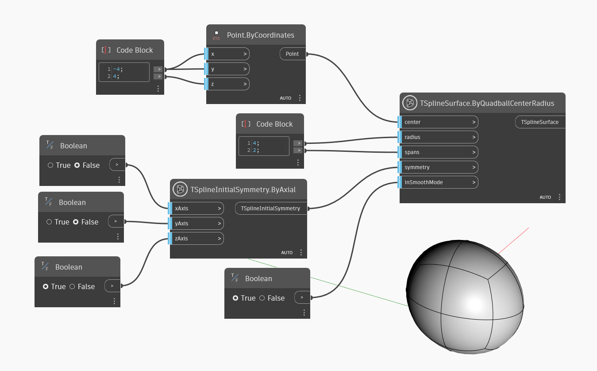

<!--- Autodesk.DesignScript.Geometry.TSpline.TSplineSurface.ByQuadballCenterRadius --->
<!--- E6WVV65M7FG2AAAGG4DXIQJPDKVNYXI5GRVNBAR4TR6T6356R2TQ --->
## In-Depth
В приведенном ниже примере создается Т-сплайновая тетрагональная сфера-примитив, расположенная вокруг точки `center`, имеющая заданный радиус (`radius`) и разделенная на заданное количество пролетов (`spans`). Исходная симметрия формы определяется входным параметром `symmetry`. Входной параметр `inSmoothMode` используется для переключения между режимами сглаживания и рамки при предварительном просмотре Т-сплайновой поверхности.

## Файл примера

