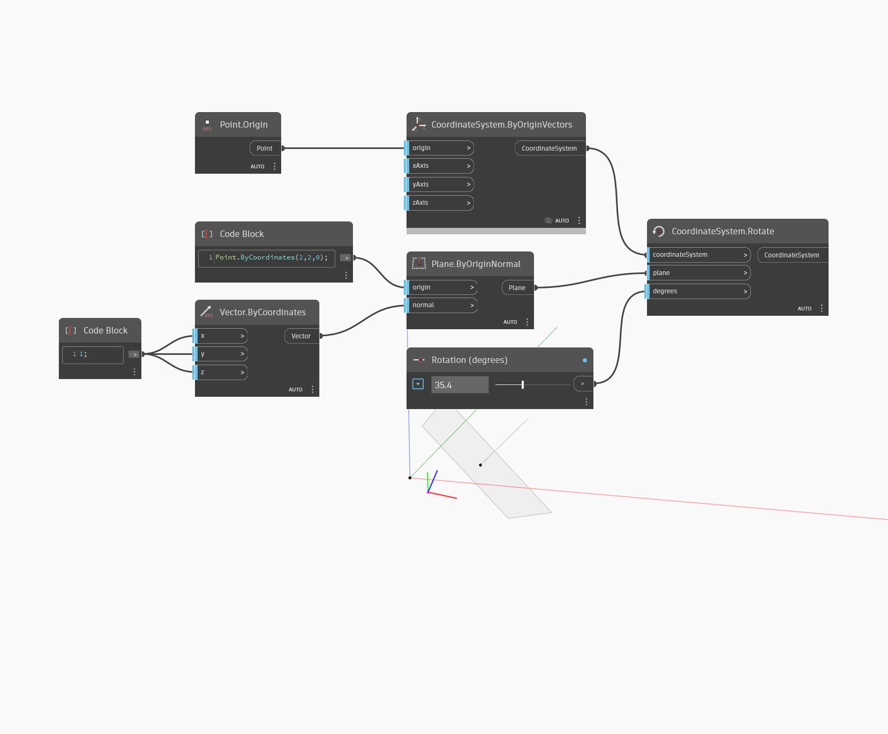

<!--- Autodesk.DesignScript.Geometry.CoordinateSystem.Rotate(plane, degrees) --->
<!--- EFSMOCLY4VKHHCT3366EWQTFWSXBTMVTLKT2H53S3PZFKGNNWXNQ --->
## Подробности
Поворот системы координат на плоскости на заданное количество градусов.
___
## Файл примера

