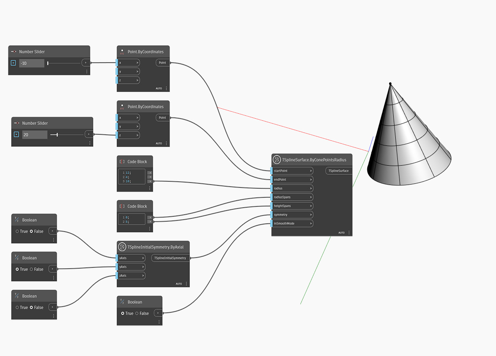

## In-Depth
В приведенном ниже примере Т-сплайновый конус-примитив создается с помощью узла `TSplineSurface.ByConePointsRadius`. Положение и высота конуса определяются входными параметрами `startPoint` и `endPoint`. С помощью входного параметра `radius` можно изменить только радиус основания, а верхний радиус всегда равен нулю. Параметры `radialSpans` и `heightSpans` определяют пролеты в радиальном и вертикальном направлениях. Исходная симметрия формы задается входным параметром `symmetry`. Если для симметричности по оси X или Y задано значение True, количество радиальных пролетов должно быть кратным 4. Входной параметр `inSmoothMode` используется для переключения между режимами сглаживания и рамки при предварительном просмотре Т-сплайновой поверхности.

## Файл примера

