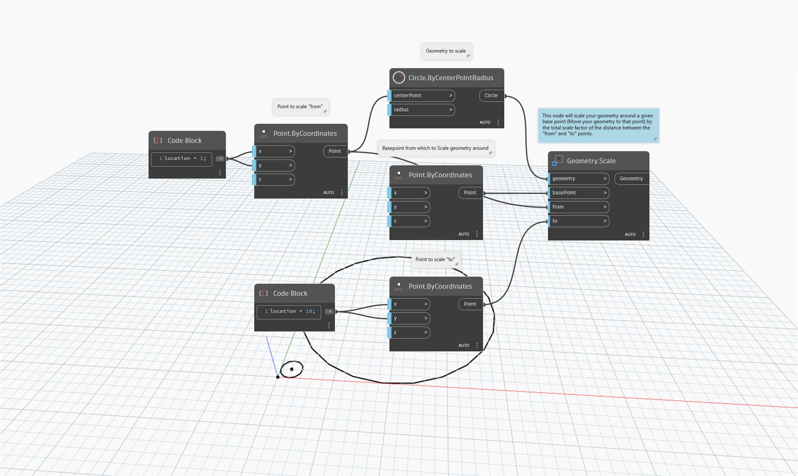

<!--- Autodesk.DesignScript.Geometry.Geometry.Scale(geometry, basePoint, from, to) --->
<!--- GYGTDRZBKUXMUX6NHZN4KHZ5XUBTIO3F5BLLADD7ADVJ2SMJZLCA --->
## Подробности
`Geometry.Scale (geometry, basePoint, from, to)` масштабирует заданную геометрию вокруг заданной точки на общий коэффициент масштабирования для расстояния между входными точками `from` и `to`.

В примере ниже окружность перемещается, и ее размер увеличивается.
___
## Файл примера

