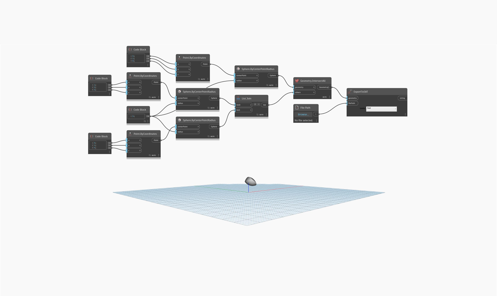

## Подробности
`ExportToSAT` позволяет экспортировать геометрию из Dynamo в файл типа SAT.

В примере ниже объект PolySurface из пересечения трех сфер можно экспортировать в файл SAT, когда выбран путь к файлу.

___
## Файл примера

