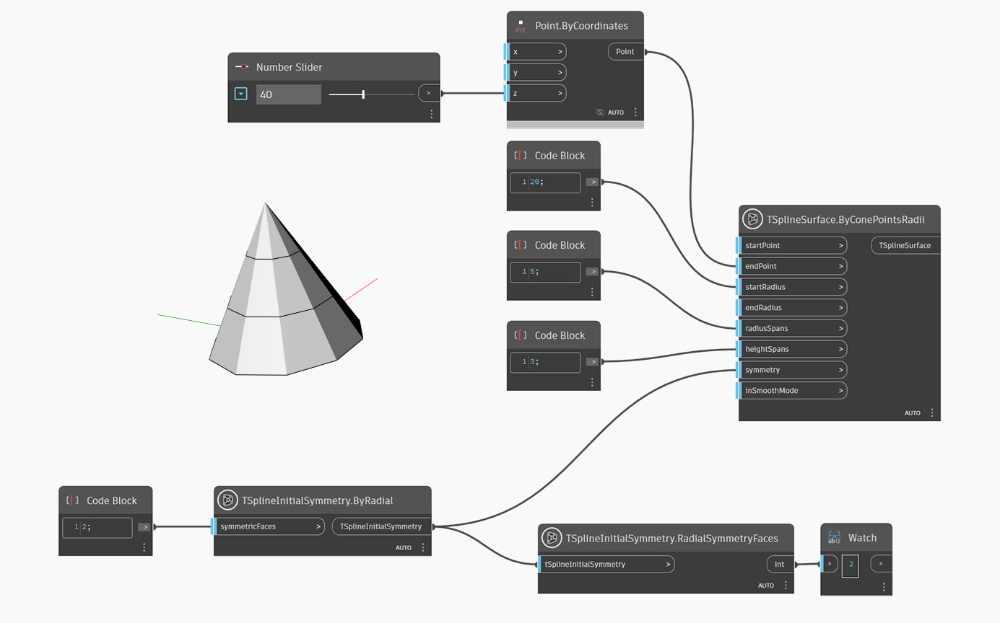

<!--- Autodesk.DesignScript.Geometry.TSpline.TSplineInitialSymmetry.RadialSymmetryFaces --->
<!--- KEPMQRB4UWQVYMWKTRJCLWPDVWKZZWWGLXPFTHDOMJBKQKGTWA7A --->
## In-Depth
В приведенном ниже примере узел `TSplineInitialSymmetry.RadialSymmetryFaces` возвращает количество граней радиальной симметрии, примененных к Т-сплайновой поверхности.

## Файл примера

